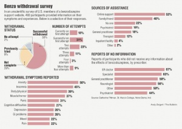

<link href="index.css" rel="stylesheet"></link>

Psychiatric
-----------

<quote><cite>When I gave him my standard objections to reliance on medication (worry about side effects, concerns about drug dependency, discomfort with the idea of taking pills that might affect my mind and change who I am), he resorted to the cliched - but nonetheless potent - diabetes argument, which goes like this: “Your anxiety has a biological, physiological, and genetic basis; it is a medical illness, just like diabetes is. If you were a diabetic, you wouldn't have such qualms about taking insulin, would you?”</cite>— <author>Stossel, Scott</author>, <book>My Age of Anxiety p. 152</book></quote>

However, blood glucose levels can be easily measured but the levels of neurotransmitters in the brain associated with anxiety or depression cannot.

### Anti-depressants

The development of the neurotransmitter-based theory of mental health is here summarized:

<quote><cite>In 1954, Marthe Vogt, a German neuroscientist at the University of Edinburgh, discovered the first convincing evidence of a neurotransmitter - norepinephrine. Later that year John Henry Gaddum, a colleague of Vogt's, discovered through a series of unorthodox experiments that serotonin, which until that point was thought to be a gut-based compound involved in digestion, was also a neurotransmitter. Gaddam took LSD - which he reported made him feel crazy for forty-eight hours and which also, according to laboratory measurements, decreased the level of serotonin metabolites in his cerebrospinal fluid. His broad conclusion: Serotonin helps keep you mentally healthy - and therefore a deficiency of serotonin can make you mentally ill.</cite>— <author>Stossel, Scott</author>, <book>My Age of Anxiety pp. 172-173</book></quote>

Only about 3-4% of the body's total serotonin is located in the brain. Over 90% of it located in the gastrointestinal tract, where it is used to regulate intestinal movements. [^1]

<quote><cite>None other than the father of the serotonin hypothesis of depression, Arvid Carlsson, has announced that psychiatry must relinquish it. In 2002, at a conference in Montreal, he declared that we must “abandon the simplistic hypothesis” that disordered emotion is the result of “either an abnormally high or abnormally low function of a given neurotransmitter.”</cite>— <author>Stossel, Scott</author>, <book>My Age of Anxiety p. 218</book></quote>

[Antidepressant Drug Effects and Depression Severity](http://jama.jamanetwork.com/article.aspx?articleid=185157)

-   “Antidepressant medications represent the best established treatment for major depressive disorder, but *there is little evidence that they have a specific pharmacological effect relative to pill placebo for patients with less severe depression*.”

#### SSRIs

<quote><cite>Exploding into the national consciousness with the March 26, 1990, edition of Newsweek, whose cover featured a green-and-white capsule alongside the words “A Breakthrough Drug for Depression,” fluoxetine, under its trade name Prozac, would become the iconic antidepressent of the late twentieth century - a blockbuster for its manufacturer, Eli Lilly... &lsqb;who&rsqb; killed the drug in development <i>seven times</i> because of unconvincing test results. After examining tepid fluoxetine trial outcomes, as well as complaints about the drug's side effects, German regulators in 1984 concluded, “Considering the benefit and the risk, we think this preparation totally unsuitable for the treatment of depression.”</cite>— <author>Stossel, Scott</author>, <book>My Age of Anxiety pp. 208-209</book></quote>

<quote><cite>A series of studies in the 1980s found imipramine, the tricyclic antidepressant, to be more effective than Prozac for treating patients with depression or panic disorder. Imipramine also trounced Paxil in two studies in the early 1980s of patients with depression. In 1989, Paxil failed to beat a placebo in more than half of its trials. Yet four years later, Paxil was approved by the FDA - and by 2000 it was the best-selling anti-depressant on the market, outselling Prozac and Zoloft.</cite>— <author>Stossel, Scott</author>, <book>My Age of Anxiety p. 209</book></quote>

<quote><cite>In Janurary 2010, almost exactly twenty years after introducing Americans to SSRIs, Newsweek published a cover story reporting on studies that suggested these drugs are barely as effective as sugar pils for the treatment of anxiety and depression.</cite>— <author>Stossel, Scott</author>, <book>My Age of Anxiety p. 213</book></quote>

<quote><cite>After reviewing dozens of studies on SSRI effectiveness, the British Medical Journal concluded that Prozac, Zoloft, Paxil, and the other drugs in the SSRI class “do not have clinically meaningful advantage over placebo.”</cite>— <author>Stossel, Scott</author>, <book>My Age of Anxiety p. 213</book></quote>

[Five reasons not to take SSRIs](https://www.psychologytoday.com/blog/obsessively-yours/201001/five-reasons-not-take-ssris)

-   “Doctors are in essence performing uncontrolled experiments on their patients, hoping that in some scattershot way they might hit on a solution.”
-   “We have no way of measuring serotonin in the brain of a living person, short of cutting open the skull. We have not come up with what a normal level of serotonin should be and below which we can say that you would be depressed and above which we can say you will be happy. People with high serotonin levels can be depressed and those with low levels can be happy.”
-   “We're not talking about anecdotal evidence as in 'they worked for me.' That level of proof applies to quack medicines and systems... We believe that the only true proof for efficacy is double-blind, randomized trials of drugs in which neither the person taking the drug nor the person administering the drug knows if the drug is real or placebo. With that high level of proof we now know that SSRIs do not work on any kind of depression other than severe depression, which is quite rare.”

#### MAOIs

<quote><cite>When patients taking MAOIs ingest things - such as wine and other fermented alcohol, aged cheeses, pickled foods, some kinds of beans, and many over-the-counter medications - that contain high levels of an amino acid derivative called tyramine, the health effects can be serious: painful headaches, jaundice, a spike in blood pressure, and in some cases severe internal hemorrhaging.</cite>— <author>Stossel, Scott</author>, <book>My Age of Anxiety p. 170</book></quote>

#### Causes for doubt

-   Medications that require cycling through various brands until the patient hits upon one that works.
-   Medications that take an abnormally long and varying amount of time for it to work.
-   Medications that are potentially more harmful than they are helpful (suicidal ideation).
-   Diagnosis's that are largely based on the subjectivity of the doctor and not based on any biological testing.
-   Medications where it is hard for the doctor to diagnosis whether or not the patient is experiencing a harmful side-effect or worsening of initial symptoms.

[The Hamilton Rating Scale for Depression](http://healthnet.umassmed.edu/mhealth/HAMD.pdf)

### Tranquilizers

<quote><cite>Every time new drug therapies come along, they raise the question of where the line between anxiety as psychiatric disorder and anxiety as a normal problem of living should get drawn. We see this again and again throughout the history of pharmacology: the rise of tranqualizers is followed by an increase in anxiety disorders diagnoses; the rise of antidepressants is followed by an increase in the rate of depression.</cite>— <author>Stossel, Scott</author>, <book>My Age of Anxiety p. 188</book></quote>

#### Benzodiazepines

<quote><cite>By the end of the decade, Librium and Valium had made Hoffman-La Roche -- “the house that Leo built” -- the biggest pharmaceutical company in the world. The benzodiazepines had become the greatest commercial success in the history of prescription drugs.</cite>— <author>Stossel, Scott</author>, <book>My Age of Anxiety p. 195</book></quote>

<quote><cite>By the middle of the 1970s, the FDA had collected numerous reports of benzodiazepine dependence. Many patients who had been on high dosages of Valium or Librium for long periods of time would experience excrucitating physical and psychological symptoms when they stopped taking the medication: anxiety, insomnia, headaches, tremors, blurred vision, ringing in the ears, the feeling that insects were crawling all over them, and extreme depression - and, in some cases, seizures, convulsions, hallucinations, and paranoid delusions. By the time Ted Kennedy led the 1979 Senate hearings on the hazards of benzodiazepines, critics had a rich literature of horror stories to draw on.</cite>— <author>Stossel, Scott</author>, <book>My Age of Anxiety p. 195</book></quote>

<quote><cite>“Valium, Librium, and other drugs of that class cause damage to the brain. I have seen damage to the cerebral cortex that I believe is due to the use of these drugs, and I am beginning to wonder if the damage is permanent,” David Knott, a physician at the University of Tennessee, warned back in 1976. In the three decades since then, scores of articles in scientific journals have reported on the cognitive impairment observed in long-term benzodiazepine users. A 1984 study by Malcolm Lader found that the brains of people who took tranquilizers for a long time physically shrank.</cite>— <author>Stossel, Scott</author>, <book>My Age of Anxiety pp. 198-199</book></quote>

[XANAX - More Addictive Than Heroin](https://www.youtube.com/watch?v=LjpD41mMG8o)

[Benzodiazepine withdrawl syndrome](https://en.wikipedia.org/wiki/Benzodiazepine_withdrawal_syndrome)

-   “Withdrawal effects caused by sedative-hypnotics discontinuation, such as benzodiazepines, barbiturates, or alcohol, can cause serious medical complications. They are cited to be more hazardous to withdraw from than opioids. Users typically receive little advice and support for discontinuation. *Some withdrawal symptoms are identical to the symptoms for which the medication was originally prescribed.*”
-   “There may be *no fundamental differences* in symptoms from either *high or low dose discontinuation*, but symptoms tend to be more severe from higher doses.”
-   “Symptoms may emerge during *gradual* or *abrupt* dosage reduction.”
-   “Failure to recognize discontinuation symptoms can lead to *false evidence for the need to take benzodiazepines*, which in turn leads to withdrawal failure and reinstatement of benzodiazepines, often to higher doses.”
-   “Protracted withdrawal syndrome refers to symptoms persisting for *months or even years*.”

[Benzodiazepines treat anxiety, cause long term problems](http://www.bendbulletin.com/home/2119922-151/benzodiazepines-treat-anxiety-cause-long-term-problems#)

-   “Colloquially known as benzos, the drugs have been in use since the 1950s. In the 1960s and ’70s, Valium became one of the most successful prescription drugs ever.”
-   “Meanwhile, in the U.K., controlled trials showed conclusively that withdrawal symptoms from regular therapeutic doses of benzos were real and that they stemmed from *physical dependence* on the drug”
-   “An editorial in the British Medical Journal questioned whether benzodiazepines should be *banned* altogether.”
-   “But in the U.S., the warning largely went unheeded. Drug companies introduced Ativan in 1977 for anxiety and Xanax in 1981 to treat panic disorder. The drugs routinely topped the list of the most prescribed and most profitable drugs.”
-   “First-line treatments for anxiety disorders are generally selective serotonin re-uptake inhibitors, the so-called SSRIs, such as Prozac or Zoloft. *Some patients have a genetic variation that blocks the SSRIs’ effect*.”
-   “Moreover, because the symptoms of withdrawal often mirror the symptoms of the original condition they were treating, doctors often assume the original condition has returned and patients need a higher dose or to take the medication more frequently.”

Vitamins
--------

[Fish Oil Supplements - Journal of American Medical Association](http://jama.jamanetwork.com/article.aspx?articleid=1899197)

-   “The results of recent studies do not offer any convincing evidence that fish oil supplements either prevent cardiovascular disease or improve outcomes in patients who already have it.”

#### Valerian

<quote><cite>Valerian is most often used as an alternative medicine for insomnia in place of hypnotic drugs. It is also sometimes used as an alternative for sedatives, such as benzodiazepines, in the treatment of certain anxiety disorders. Whether or not valerian is an efficacious treatment for insomnia is still a very open question. Multiple recent systematic reviews of the medical research literature and meta-analyses have produced conflicting conclusions regarding its efficacy.</cite>— <author>Wikipedia</author>, <book><a href='https://en.wikipedia.org/wiki/Valerian_(herb)#Medicinal_use'>Valerian</a></book></quote>

Illegal
-------

[Scientist Argues Restrictions On Psychedelic Drugs Should Be Lowered](http://www.iflscience.com/health-and-medicine/restrictions-psychedelic-drugs-should-be-lowered)

#### Cocaine

<quote><cite>Sigmund Freud, the father of psychoanalysis, relied heavily on drugs in managing his anxiety. Six of his earliest scientific papers were on the benefits of cocaine, which he used regularly for at least a decade beginning in the 1880s.</cite>— <author>Stossel, Scott</author>, <book>My Age of Anxiety p. 154</book></quote>

#### MDMA

[MDMA the Movie](http://www.mdmathemovie.com/)

[Can we use MDMA to treat PTSD](http://www.skepticink.com/gps/2015/04/22/can-we-use-mdma-to-treat-ptsd/)

-   “The effects resemble the effects of both stimulants and psychedelics and are reported to *decrease fear* and increase trust and empathy”
-   “Brain scans have revealed that MDMA *decreases blood flow to the amygdalla*, a brain region responsible for fear, and *increases blood flow to the prefrontal cortex*, where higher order functions are processed. It also releases serotonin and other feel-good neurotransmitters, as well as naturally occurring hormones prolactin and oxytocin.”

References
----------

<references/>

[^1]: Wikipedia. [Serotonin](https://en.wikipedia.org/wiki/Serotonin)
